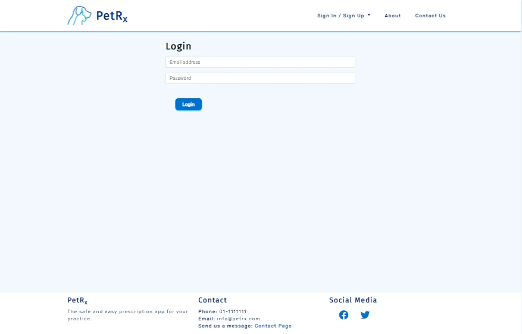
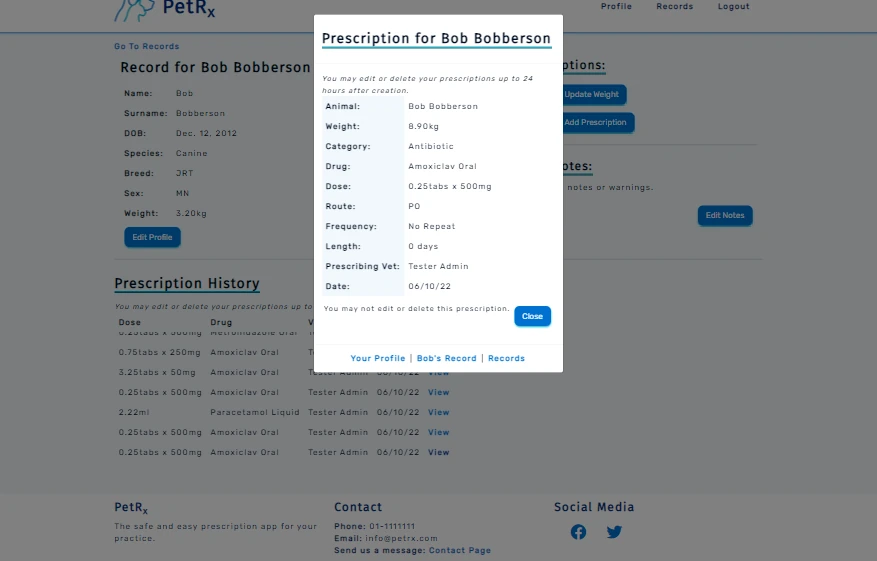

# PetRx

PetRx is a web app designed for veterinarians to prescribe and record medications for their patients, quickly and safely.

Unregistered users can view the index, about and contact pages to learn about the product and send a message. Users
can sign up for the site from the registration form, but need to wait for approval from the admin before being able
to access the features. 

Registered vets can create a new animal record, browse a list of existing records, or search for a specific record. From the
animal's record, a vet can edit the animal's details, update the weight only, and leave notes or warnings on the
animal's record. They can add a prescription easily by clicking on the "Add Prescription" button and selecting the
medication they wish to prescribe. Prescriptions can then be easily viewed in a list on the animal's profile.

The medications available for prescription are controlled from the admin panel, restricting who can create, update 
and delete medications from the site. The admin user can also create, update and delete animal records and vet
profiles.

The live site can be found here: [PetRx](https://ci-pp4-petrx.herokuapp.com/)

# Table of Contents
- [User Experience](https://github.com/SJECollins/ci-pp14-petrx#user-experience)
- [Features](https://github.com/SJECollins/ci-pp4-petrx#features)
  - [General](https://github.com/SJECollins/ci-pp4-pet-rx#general)
  - [VetProfiles](https://github.com/SJECollins/ci-pp4-pet-rx#vet-profiles)
  - [Records](https://github.com/SJECollins/ci-pp4-pet-rx#records)
  - [Prescriptions - Vet](https://github.com/SJECollins/ci-pp4-pet-rx#prescriptions---vet)
  - [Prescriptions - Admin](https://github.com/SJECollins/ci-pp4-pet-rx#prescriptions---admin)
- [Design](https://github.com/SJECollins/ci-pp4-petrx#design)
- [Technologies Used](https://github.com/SJECollins/ci-pp4-petrx#technologies-used)
- [Testing](TESTING.md)
- [Deployment](https://github.com/SJECollins/ci-pp4-petrx#deployment)
- [Credits](https://github.com/SJECollins/ci-pp4-petrx#credits)

# User Experience

### User Stories

The user stories used as part of the planning for the website have been consolidated here.

- As a site user I can register on the site so that have access to the features for animal profiles and prescriptions
- As a site user I can edit my profile so that I can change my registered name or email
- As a site user I can create a new animal profile so that register a new animal's details in the database
- As a site user I can search so that I can find an individual animal's record
- As a site user I can view an animal's entry so that I can check their details on the database
- As a site user I can edit an animal's entry so that I can update their details on the database
- As a site user I can create a new prescription so that I can prescribe a medication to an animal and have it linked to their details on the database
- As a site user I can get a calculated dose for tablets so that I don't have to calculate tablets myself and the prescription will be accurately recorded
- As a site user I can filter drugs by category when adding a prescription so that I can find drugs more easily
- As a site user I can update an existing prescription so that changes I made are reflected in the database
- As a site user I can delete a prescription so that it is removed from the animal's record if it was incorrectly added
- As a site user I can view a list of the drugs available on the system so that I can see which drugs are available to prescribe
- As a site user I can search the drugs available on the system so that I can find a specific drug I may be looking for
- As a site user I can go to a detailed view of a drug so that I can review the details of the drug (eg, dose, warnings)
- As a site user I can view a list of previous prescriptions on an animal's profile so that I can review their previous prescriptions
- As a site user I can view a list of my previous prescriptions on my profile so that I can review the previous prescriptions I have created
- As a site user I can go to a detailed view of a prescription so that I can review the details of a prescription
- As a site admin I can add a medication so that site user's may prescribe it
- As a site admin I can edit a medication so that I can change the details of the prescription drug
- As a site admin I can delete a medication so that it can no longer be prescribed
- As a site admin I can delete a user profile so that they are no longer able to access the site

# Features
## General
### Navigation Bar

Navbar

The navigation bar is featured across all pages.

For unregistered or logged out users of the site, the navbar displays links to "Sign In / Sign Up", "About" and "Contact", with
the "Sign In / Sign Up" link opening a dropdown when clicked on, listing the two pages. On large screens, the 
links are visible on the right hand side of the navbar. The list collapses into a dropdown menu on smaller screens 
which can be toggled by clicking the bars icon.

For registered users of the site, the navbar displays links to "Profile", "Records" and "Logout". If a user is
registered by not active, the "Profile" and "Records" links redirected to a restricted page that alerts the user
that their account is awaiting approval. Once approved, the "Profile" link navigates to the current users profile
page, and the "Records" link navigates to the main records page. Similarly to unregistered users, the navbar 
collapses on smaller screens.

The navbar is a slightly modified version of the first example from [Bootstrap's navbar documentation](https://getbootstrap.com/docs/5.2/components/navbar/).

On the left hand side of the screen, there are the logo and "PetRx" title which act as links to the index page.
On smaller screens, the title is displayed centrally to make the navbar look balanced.

### Footer

Footer

The footer is featured across all pages.

The footer features three small sections. The first has the company name and a short tagline for the app. The second features contact 
information and a link to the contact page so that company contact information is available on all pages of the
website. The final small section features social media links. On large screens, the sections are presented side by
side as columns, but collapse into rows on smaller screens with the company name and tagline on top.

### Index Page

Index Page Unregistered

Index Page Logged In

The index page has three states depending on the user.

For unregistered or logged out users, the index page displays a short welcome and two call-to-action buttons for 
"Login" and "Register" in the first section. The second section contains a brief "About PetRx" blurb about the site that
directs the user to the about page with an inline link, and a short "Have a Question?" segment directing the user to the contact page
to get in touch with an inline link. There are also images in both section intended to feature promotional images,
though currently contain placeholders.

For users who are registered but not active, the first section welcomes the user by name, but beneath that is text
explaining to the user that their account is pending approval with a link to logout. The second section contains
three segments of text: "Your Profile", "Add Animal", and "Animal Records". These give a brief introduction to the
user on how to use the site and the features available, with inline links to the referenced pages. However, these 
links navigate to a restricted page advising the user their account is awaiting approval, until the admin activates 
the account.

For users who are registered and are active, the first section welcomes the user by name and features a list of the
most important links: "Your Profile", "Add Animal" and "Animal Records". The second section of the page is the same
as for users who are registered but not active, however they can follow the links to the correct pages.

On larger screens, the index sections are displayed as rows with their contents displayed as columns. On smaller
screens, the contents of the sections are displayed as rows in one column.

### About Page

About Page

The about page is available for users who are not registered or who are not logged in through a link in the navbar. 
The primary purpose is to 
act as marketing for the site for users who are learning about the site. The first section features 
a paragraph of text describing the site and it's worth to the user, and a list of "Benefists". The second section
features more indepth descriptions about the benefits of the site and explains how the site's features meet those
benefits.

On larger screens, the about page is displayed in rows with the contents displayed as alternating columns of text
and promotional material. On smaller screens, page is displayed as alternating rows of text and promotional material. 

### Contact Page

Contact Page

The contact page is available to all users through a link in the navbar for users who are not logged in or a link in
the footer. It features a simple form that requires the name, email and message
from the user. It sends the message to the site owner and provides the user with feedback by displaying "Message
sent."

## Vet Profiles

### Registration Page

Registration Page

The registration page is accessible through a "Sign Up" link in the navbar or "Register" CTA button on the index page
for users who are not logged in. The page features a simple form that requires the users "Email", "First Name", "Last
Name", "Password" and "Confirm Password". 

If the user attempts to register while leaving any of the fields blank, they are prompted to fill in the missing 
field. If the user attempts to register with an email that is already registered, they are given
a message that the email is already in use. If the user attempts to register without the passwords matching, 
they given a message that the password fields don't match. 

When the user registers, they are logged in and redirected to the index page where they are informed their account 
is awaiting approval.

### Login Page

Login Page

The login page is accessible through a "Sign In" link in the navbar or "Login" CTA button on the index page for users
who are not logged in. The page features a simple form that requires the user's "Email" and "Password". If the user
attempts to submit an empty field, they are prompted to fill in the required field. If the user's credentials are 
invalid, they are given a message that their login is invalid.

When the user logs in, they are redirected to their profile if their account is active. If their account is not 
active, the user is redirected to the index page informing them that their account is awaiting approval.

### Profile

Profile

The user profile page is available for users who are registered and who's account has been set to active by the admin.
Each user can only view their own profile. The profile page features two sections.

The first section includes the heading "Profile for {user name}", where the user's first and last name are present to
provide feedback to the user that they are viewing their own profile. Below the heading, the user's details are
displayed: "Name", "Surname" and "Email Address". Below this, an "Edit Profile" button allows the user to edit their
details. On large screens, "Go To:" with links to "Animal Records" and "Available Drugs" is displayed on the right
of the screen next to the user's details. On smaller screens, the links are present below the "Edit Profile" button.

The second section features the user's "Prescription History" which displays the list of their prescriptions. Below
the "Prescription History" heading, there is a line of text that explains to the user the restrictions on editing
and deleting prescriptions. Below this, the prescriptions are presented in a table ordered by date, starting with
the most recent. 

On larger screens, the table includes the details "Animal", "Dose", "Drug", "Date" and "View". On smaller screens,
the details on the table include "Animal", "Date" and "View". "Animal" is the animal's full name, "Dose" is the 
dosage of the drug that was administered, "Drug" is the drug's name, "Date" is the date the prescription was created
and "View" is a link to the full details of the prescription. The details provided in the table are intended to 
provide just enough context so that user can find previous prescriptions. They can then click "View" to review the 
prescription in more details.

### Edit Profile

Edit Profile

The edit profile button on the user's profile navigates to the "Edit Profile" form which is prepopulated with the 
current user's details. The user is able to change their email, name and surname through this form. All fields are
required and the user is prompted to fill an empty field if they attempt to submit the form with empty fields. The 
user is capable of changing their email, but only to another email which is not currently registered on the site. They
will receive a message that the email is already in use if they attempt to do so and the form will reset to their
current details.

## Records

Records

The "Records" page is available to all who are registered and whose account is active. 

At the top of the page, below the "Records" title, there is a link to the "Add Animal" page and a link "To Available
Drugs". On larger screens, a search bar is available on the right of the page. On smaller screens, the search bar
is available below the links.

Below, all the current records are displayed in a list beneath the "All Records:" title. The records are ordered 
alphabetically by surname. The list features pagination so that ten records are displayed per page so that as the
records grow the 

### Search Records

Search Records

On the "Records" page, a search bar is available for the user to search the available records.

The search function searches by the animal's name or the surname. The placeholder text prompts the user to search by
the surname as it features a rudimentary autocomplete with a dropdown for the field that is populated with animal's
surnames. However, if a user enters a piece of text that is contained in one animal's name and another animal's
surname, both animals will be returned in the results.

Upon searching, the user is brought to the search results. At the top of the page are links "To Records" and "To
Available Drugs" with the search bar. Below "Search Results:" are the list of results presented in a table with 
the details "Animal", "Species", "Breed", and "DOB" to help the user narrow down the record they are looking for.
Below the results is another link "Back to Records".

### Add Animal

Add Animal

The "Add Animal" page is available to users who are registered and whose account is active.

The form requires the animal's "Name", "Surname", "Date of birth", "Species", "Breed", "Sex" and "Weight". The Date
of birth field provides the user with a datepicker to make input easier and prevent user error. The fields for 
Species and Sex provide dropdown menus with options for the user. The field for weight takes a number. As all fields
are required, the user is prompted to fill any empty fields if they attempt to submit the form without all fields
filled. 

Upon submitting the form, the user is redirected to the Records page.

### Animal Record

Animal Record

The page for an animal's record is laid out very similarly to the user profile with some slight changes to the features.

At the top of the page, above the "Record for {animal name}" where {animal name} is the name and surname of the animal,
a "Go To Records" link is provided. The animal's details are presented and include all the details provided when
the record was created. Like the user profile, it features an "Edit Profile" below the animal's details.

On larger screens, to the right is the "Options:" which includes two buttons. The "Update Weight" button opens a modal
with a field for weight and the "Add Prescription" opens a modal to add a prescription. Below these options is a 
segment for "Notes:" which can be edited through the "Edit Notes" button that opens a modal with a textarea with the
current notes.

On smaller screens, "Options:" and "Notes:" are displayed below the "Edit Profile" details.

Like the user's profile, second section features the user's "Prescription History" which displays the list of 
the animal's prevoius prescriptions. Below the "Prescription History" heading, there is a line of text that explains
to the user the restrictions on editing and deleting prescriptions. Below this, the prescriptions are presented 
in a table ordered by date, starting with the most recent. 

On larger screens, the table includes the details "Dose", "Drug", "Vet", "Date" and "View". On smaller screens,
the details on the table include "Drug", "Date" and "View". "Dose" is the dosage of the drug that was administered, 
"Drug" is the drug's name, "Vet" is the name of the prescribing vet, "Date" is the date the prescription was created
and "View" is a link to the full details of the prescription. The details provided in the table are intended to 
provide just enough context so that user can find previous prescriptions. They can then click "View" to review the 
prescription in more details.

### Add Prescription

Add Prescription

The "Add Prescription" button on an animal's record opens a modal displaying the prescription form.

The form contains four fields: "Category", "Drug", "Frequency" and "Length". The first two fields are chained drop
menus. When the user selects a category (e.g. "Antibiotic"), the drug field is then populated by all associated
drugs to make finding the desired drug easier. Both of these fields are required.

The field for frequency of dosing is not a required field. The user has the option to select from list a of
dosing intervals if they would like. Similarly, the field for the length of the prescription is optional. It defaults
to 0 days for the case that the user does not wish to give more than one dose.

Upon submitting the new prescription, the modal closes and the animal's prescription history is update to include
the new prescription. The user can also change their mind and click away from the modal or click the "Close" button
to close the modal.

When a user submits a prescription, the dose given to the animal is calculated as part of the model's save method. The model
takes the animal's weight and the dose of the drug and depending on the type of the drug, calculates what dosage the
the animal receives. This is one of the main features, that the user does not have to do the calculations themselves.
The output in the prescription is the dose to administer in either millilitres or milligrams, or number of tablets 
of a given strength.

### Edit Record

Edit Record

The "Edit Record" button beneath the animal's details brings the user to the edit record form. It is prepopulated
with the current animal's details. The user is able to change all of the animal's details through this form. All 
fields are required and the user is prompted to fill an empty field if they attempt to submit the form with empty 
fields. 

Upon submitting the form, the user is brought back to the animal's profile.

### Update Weight

Update Weight

The "Update Weight" button opens a modal which features a single field to update the animal's weight. It is
prepopulated with the animal's current weight. As the weight
is one of the most important factors in calculating the correct dosage for medication, this adds a quick and easy
way to update it without opening the whole "Edit Record" form. The field takes a decimal input and is required. 

If the user changes their mind, they can click away from the modal or click the "Close" button to close the modal.

### Notes

Notes

The "Edit Notes" button opens a modal with a text field. 

Notes are not mandatory for the animal's record, but provide a way for a vet to leave a quick note on an animal's 
record for any details or considerations they feel are important. For example, if the animal is elderly, the vet
may decide to leave a note on the record that the dog should have its bloodwork checked before it's next prescription
of NSAIDs. Any vet can edit the notes. They are not required and can be left blank. If empty, "No notes or warnings"
is displayed on the animal's profile.

## Prescriptions - Vet

### Available Drugs

Available Drugs

The "Available Drugs" page is accessible to users who are registered and whose account is active.

The page is similarly structured to the Records page. At the top, there is a link "To Records" beneath the "Available
Drugs" heading. On large screens, a search bar is available to the right side. On smaller screens, the search bar
is below the link.

Below, all the medications currently available are listed alphabetically below the "All Drugs:" heading. Like the Records
page, the list of medications features pagination with ten medications per page. 

### Search Drugs

Search Drugs

On the "Available Drugs" page, a search bar is available for the user to search the available medications.

The search function searches by the medication's name. The placeholder text prompts the user to search by
the name as it features a rudimentary autocomplete with a dropdown for the field that is populated with medication's name.

Upon searching, the user is brought to the search results. At the top of the page are links "To Records" and "To
Available Drugs" with the search bar. Below "Search Results:" are the list of results presented in a table with 
the details "Drug" and "Category to help the user narrow down the medication they are looking for.
Below the results is are the links "Back to Drugs" and "To Records".

### Detailed Drug View

Detail Drug View

On the "Available Drugs" and "Search Results" pages, the medication's names link to their page which features the
details of the medication. This page provides the medications name, category, dosage, route and warnings. This
information is inputted in the admin panel by a senior member of staff and is available for any registered, active
user to review.

Below are the links "Your Profile", "Drugs", and "Records".

### Detailed Prescription

Detailed Prescription

Detailed Prescription - Can't Edit

When the user clicks "View" on a prescription on either their own profile or on an animal's record, a modal is 
displayed which shows the prescription.

This modal provides a detailed breakdown of the prescription, including the animal, it's weight, the category of the
drug prescribed, the name of the drug prescribed, the dosage given, the route, the frequency and length of dosing,
the name of the prescribing vet and the date the prescription was created. Included is text advising the user of
the restricitions for editing and deleting the prescription.

If the user is the prescribing vet and it is within 24 hours from the creation of the prescription, "Edit" and "Delete"
buttons are displayed. However, if it has been more than 24 hours or the vet viewing the prescription is not the
prescribing vet, these buttons are not accessible. If the user chooses to edit the prescription, the "Edit Prescription"
modal is then displayed. If the user chooses to delete the prescription, the modal then displays confirmation that
the prescription has been deleted. A "Close" button is always available to dismiss the modal.

At the bottom of the modal, links to "Your Profile", "{animal}'s Record", and "Records" are available.

### Edit Prescription

Edit Prescription

If the user selects "Edit Prescripton" on the prescription modal, a modal displays with a form that's identical to
the form to add a prescription. It is prepopulated with the previously selected details. Upon submitting, the modal
closes and the list of prescriptions on the user's profile and the animal's records are updated. A "Close" button is
also present on the modal so that the user can close the modal without submitting the form. 

## Prescriptions - Admin

### Category

Admin - Category

From the admin panel, the admin user is able to create, update and delete categories for medications. There is a
single "Name" field required to create a category. The categories are displayed as a list alphabetically.

### Drug

Admin - Drug

From the admin panel, the admin user is able to create, update and delete medications. The medications are displayed 
alphabetically, with their dose and category.

When adding a new medication, the admin user is required to fill in the fields "Name", "Type", "Dose", "Measure",
"Category", "Route" and "Warnings". "High dose" and "Tablet strength" are not required fields. 

- The "Name" field is required. It takes a text input and will be displayed in the string representation of the model.
The medications are default ordered alphabetically by their name.
- The "Type" field is required and provides a dropdown list of options including "Injectable", "Liquid" and "Tablet" 
which relates to the save method for prescriptions and decides how the dosage will be calculated. 
- The "Dose" field is required. It takes a decimal input. It is used for calculating the dose administered to an 
animal as part of the Prescription model.
- The "High dose" field is not required. It takes a decimal input. It is used in the case of "Tablet" type medications
which require a safe range of doses for prescriptions. There is helper text displayed below the field to advise users
of this. It is used along with the "Dose" for calculating the number and strength of tablets administered to an 
animal as part of the Prescription model.
- The "Tablet strength" field is not required. It takes a text input. It is used in the case of "Tablet" type medications
to provide the tablet strengths available for administration. Helper text advises the user to add the numbers of the
strengths separated by commas. As part of the save method in the Prescription model, the strengths are separated and
then converted to integers. The dose administered to an animal is then expressed as quarters of a tablet of a given 
strength. It aims to provide whichever dose would be easiest to administer
within the safe dose range. Quarters were chosen as the smallest unit as most tablets can be easily quartered, but 
cannot be easily broken smaller. If there are no available doses in that range for any tablet strengths provided,
"No tablet dose in range" is returned in the prescription.
- The "Measure" field is required and provides a dropdown list of options. It is used to display the strength or size
of a medication in a prescription.
- The "Category" field is required and provides a dropdown list of options. It is used for the chained dropdown menus
on the "Add Prescription" and "Edit Prescription" forms to aid the user in selecting the medication they wish to
prescribe.
- The "Route" field is required and provides a dropdown list of options. It is used to display the route by which the
medication is administered in a prescription.
The "Warnings" field is required and provides a text input. It is used to display any warnings the admin user wishes
to associate with the drug that they feel are necessary to highlight. It is displayed as part of the detailed drug
page.

The admin user is also able to edit any of these details. They are also capable of deleting a drug entry. However, 
this will then destroy any associated prescriptions.

### Records

Admin - Record

From the admin panel, the admin user is able to create, update and delete records. The records are displayed
as a list with the animal name, surname, date of birth, species and breed. They are ordered alphabetically by 
default by their surname.

The admin user can add a new animal record in much the same way as vet user, though the "Note" field is available
when adding the record. They are also capable of editing an animal's record. Unlike the vet users, the admin user
has the ability to delete an animal's record.

### VetProfiles

Admin - VetProfiles

From the admin panel, the admin user is able to create, update and delete user profiles. User profilse are displayed
as a list with the email, first name, last name, last login, is admin, is active and is staff. They are ordered 
alphabetically by default by their email.

The admin user can add a new user profile by simply adding an email and password. After, they can edit the profile
and add the first and last names. The admin is able to activate a profile by editing an existing profile, checking
"is active" and saving the profile. This is the current process for activating a profile to prevent users from
accessing restricted content without approval.

The admin user is also capable of deleting user profiles.

## Restricted

Restricted

For users who have registered but whose account is awaiting approval, the restricted view informs them that they do not have access when they attempt to navigate to certain parts of the website (e.g. their profile). This prevents users from registering accounts and immediately having access to the features and information on the site by allowing the admin to screen user accounts.

## Error Pages

### 403

Example Title

### 404

Example Title

### 405

Example Title

### 500

Example Title

## Future Features
1. __Improved Dosing__. In the future it may be beneficial to allow the prescribing vet options of doses to prescribe for a given drug, or in some cases to enter their own dose for administration. 
2. __Prescription Warnings__. 
3. __Owner Profiles__. A potential future feature to allow animal owners to view their animal's record, review the prescription history and request prescription renewals.  
4. __Improved Search Functionality__. Extending search functionality. Particularly with the addition of owner details, as record numbers grow it would make search records easier to be able to search with a combination of details, e.g. owner's phone number, address, etc.

# Design

## Wireframes

Wireframes were created in Balsamiq. They were used for initial planning of template layouts.

Index Wireframe

About Wireframe

Contact Wireframe

Register Wireframe

Login Wireframe

Vet Profile Wireframe

Records Wireframe

Animal Record Wireframe

Prescribe Wireframe

## Colour

A blue colour palette was used for this project based on the association of the colour with healthcare. The main background colour is a white with a hint of blue to give a clean appearance. The main font colour is almost black to aid readability. 

A secondary font colour of dark blue was used for text in the header and footer to keep with the style. Buttons and links are styled in lighter shades of blue to stand out and indicate interactivity.

## Typography

Fira Sans and Rubik were imported from Google Fonts. They were chosen for their readability and similarity, to create easily legible content that is pleasant to read without being distracting.

## Agile Methodology

[GitHub Projects Page](https://github.com/users/SJECollins/projects/3/views/1)

GitHub Projects was used in part for the planning of this website to create and track User Stories as they were implemented and fulfilled.

## ERD

The below Entity Relationship Diagram was created on [diagrams.net](https://www.diagrams.net/). It illustrates the relationships between the 5 models present in the project: Vet, Record, Category, Drug and Prescription.

ERD

## Technologies Used

- [HTML5](https://en.wikipedia.org/wiki/HTML5): mark-up language.
- [CSS3](https://en.wikipedia.org/wiki/CSS): styling.
- [GIT](https://git-scm.com/): for version control.
- [GitHub](https://github.com/): for host repository.
- [Gitpod](https://www.gitpod.io/): online IDE.
- [Google Fonts](https://fonts.google.com/): to import fonts.
- [Font Awesome](https://fontawesome.com/): to import icons.
- [Balsamiq](https://balsamiq.com/): to create wireframes.
- [GIMP](https://www.gimp.org/): to edit images, create a mockup and select colours.
- [Inkscape](https://inkscape.org/): to create the logo.

## Testing

Testing for the site can be found at the below link:

[Link to TESTING.md](TESTING.md)

## Deployment
### Steps to deploy site:
- In the GitHub repository, navigate to the "Settings" tab.
- Scroll down to "Pages" in the menu on the left hand side.
- Under the heading "Source", click the drop-down menu and select "main" branch.
- The page will automatically refresh with a link to the deployed website.
- It may not go live for a few minutes, refresh the page to update the link.
- Once deployed, the live website will automatically update when commits are made to the main branch.

The live site can be found here: [The Hoggy Hospital](https://sjecollins.github.io/ci-pp1-hoggy-hospital)

### Steps to clone site:
- In the GitHub repository, click the "Code" button.
- Select "HTTPS" and copy the URL.
- Open Git Bash and navigate to the repository where you would like to locate the cloned repository.
- Type "git clone" followed by the copied URL.
- Press enter to create the clone.

## Credits
### Code
- The code for the custom user model allowing registering with email based on tutorial by [Coding With Mitch](https://www.youtube.com/watch?v=eCeRC7E8Z7Y&ab_channel=CodingWithMitch)
- The code for testing cutsom user models is based on this tutorial by [Michael Herman on testdriven.io](https://testdriven.io/blog/django-custom-user-model/)
- The code for pagination is from the [Official Django Documentation](https://docs.djangoproject.com/en/4.1/topics/pagination/)
- The code for search is based on tutorial by [Codemy.com](https://www.youtube.com/watch?v=AGtae4L5BbI&ab_channel=Codemy.com)
- The code for chained dropdown in the prescription form is from this tutorial by [BugBytes](https://www.youtube.com/watch?v=uU1uLYaNr9U&ab_channel=BugBytes)
- The code for using htmx to display prescription lists and modals is based on this tutorial by [Benoit Blanchon](https://www.youtube.com/watch?v=3dyQigrEj8A&ab_channel=BenoitBlanchon)
- The code for a custom error handlers is based on this tutorial by [Cryce Truly](https://www.youtube.com/watch?v=3SKjPppM_DU&ab_channel=CryceTruly)

### Media
- Icons are from [Font Awesome](https://fontawesome.com)
- The  fonts are imported from [Google Fonts](https://fonts.google.com)

- Images from [Pexels](https://pexels.com):
  - [Black cat](https://www.pexels.com/photo/black-cat-holding-persons-arm-1049764/) by Ruca Souza
  - [Cat paw](https://www.pexels.com/photo/orange-cat-foot-on-laptop-keyboard-1440387/) by Александар Цветановић
- Images from [Unsplash](https://unsplash.com):
  - [Collie at desktop](https://unsplash.com/photos/zWOQD6fFCBs) by Pavel Herceg
  - [Safe cat](https://unsplash.com/photos/A7nK49HCqSI) by Aleksandar Cvetanovic
  - [Pom at tablet](https://unsplash.com/photos/gySMaocSdqs) by Cookie the Pom

### Acknowledgement
I'd like to thank my mentor, Brian Macharia, for providing very good advice, tips and feedback, as well as excellent resources that aided greatly in organising and implementing this project.
